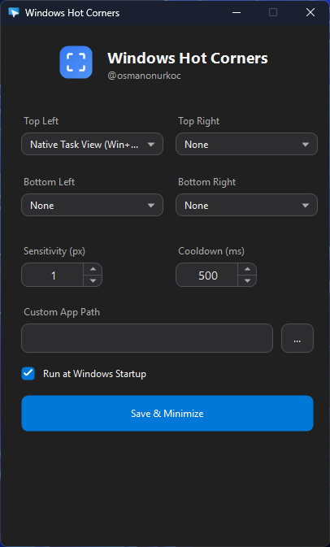
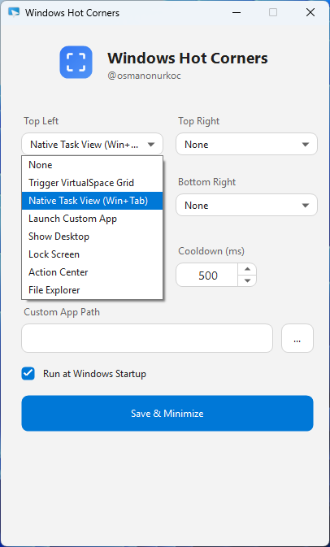

# 🖥️ Windows Hot Corners

A lightweight, native C# application that brings the productivity of macOS/Linux "Hot Corners" to Windows 10 and 11. Move your mouse cursor to any screen corner to trigger system actions instantly.

[](https://github.com/osmanonurkoc/HotCorners/releases/latest)


## 📸 Overview

*Tired of pressing Win+Tab? Just flick your mouse to the top-left corner.*

This tool runs quietly in the system tray and monitors your mouse cursor position. When the cursor hits a screen corner, it executes a pre-configured action. It features a custom-built, modern UI that automatically adapts to your Windows System Theme (Dark/Light Mode).

## 📸 Screenshots

 

## ✨ Key Features

* **🎨 Theme-Aware UI:** The settings window automatically detects and switches between Dark and Light modes based on your Windows personalization settings.
* **⚡ Zero Latency:** Built with native Win32 APIs (`User32.dll`, `Dwmapi.dll`) for instant trigger response.
* **🚀 Custom Actions:**
  * **Task View (Win+Tab):** Overview of all open windows.
  * **Show Desktop:** Instantly hide all windows.
  * **Action Center:** Open notifications and quick settings.
  * **Lock Screen:** Secure your PC immediately.
  * **Custom App Launcher:** Run any `.exe`, script, or command.
* **⚙️ Fine-Tuning:** Adjustable corner sensitivity (pixels) and cooldown timer (ms) to prevent accidental triggers.
* **👻 Unobtrusive:** Minimizes to the System Tray and uses negligible system resources (< 10MB RAM).

## 🚀 Getting Started

### Prerequisites
* **OS:** Windows 10 or Windows 11.
* **Runtime:** [.NET Desktop Runtime 6.0](https://dotnet.microsoft.com/en-us/download/dotnet/6.0) or higher.

### Installation

1. Download the latest `WindowsHotCorners.exe` from the **[Releases Page](https://github.com/osmanonurkoc/HotCorners/releases/latest)**.
2. Place the executable in a permanent folder (e.g., `C:\Tools\HotCorners`).
3. Double-click to run.
4. Configure your corners and check **"Run at Windows Startup"**.
5. Click **Save & Minimize**.

## 🛠️ Compilation (For Developers)

The project is designed as a **Single-File Application** for easy portability.

**Build Requirements:**
* .NET SDK 6.0 or newer.

**Build Command:**
Use the provided `build_script.bat` or run:
```bash
dotnet publish -c Release -r win-x64 --self-contained true -p:PublishSingleFile=true
```

## ⚙️ Configuration

Configuration is stored in `%LocalAppData%\HotCornersApp\config.json`.

**Supported Actions:**

-   `None`
    
-   `Trigger VirtualSpace Grid` (Ctrl+Shift+Tab) [Download VirtualSpace](https://github.com/newlooper/VirtualSpace)
    
-   `Native Task View` (Win+Tab)
    
-   `Launch Custom App`
    
-   `Show Desktop` (Win+D)
    
-   `Lock Screen`
    
-   `Action Center` (Win+A)
    
-   `File Explorer` (Win+E)
    

## ⚠️ Disclaimer

This tool simulates keyboard input (`keybd_event`). Ensure you do not have conflicting hotkey software running.

## 📄 License

This project is licensed under the [MIT License](https://www.google.com/search?q=LICENSE).

----------

_Created by [@osmanonurkoc](https://github.com/osmanonurkoc)_
